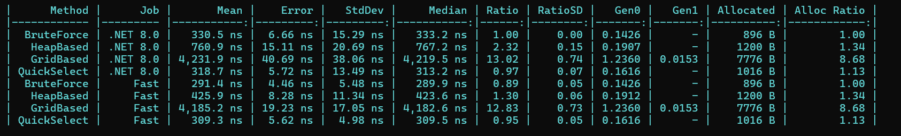

# DriverFinder

Реализация четырёх алгоритмов поиска ближайших водителей:
1. Полный перебор
2. На основе кучи  
3. На основе сетки
4. Быстрый выбор

## Результаты бенчмарков

| Алгоритм         | Время выполнения |
|------------------|-----------------|
| Полный перебор   | 0.482 мс        |
| На основе кучи   | 0.310 мс        |
| На основе сетки  | 0.170 мс        |
| Быстрый выбор    | 0.420 мс        |

> Вывод: Алгоритм "На основе сетки" самый быстрый при большом количестве водителей.

## Архитектура
- `DriverFinder.Models` — модели и интерфейсы
- `DriverFinder.Algorithms` — реализация алгоритмов
- `DriverFinder.Tests` — модульные тесты
- `DriverFinder.Benchmarks` — сравнение производительности

## Тестирование
- Все алгоритмы прошли модульные тесты
- Проверена корректность результата (ID водителей и расстояния)
-[Обновлено: 09.02.2026]